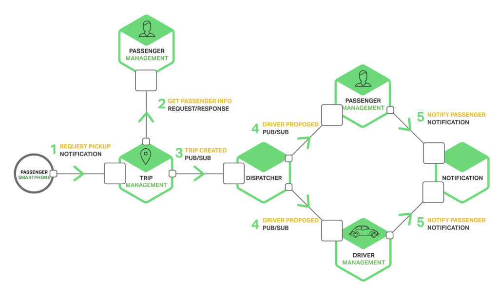
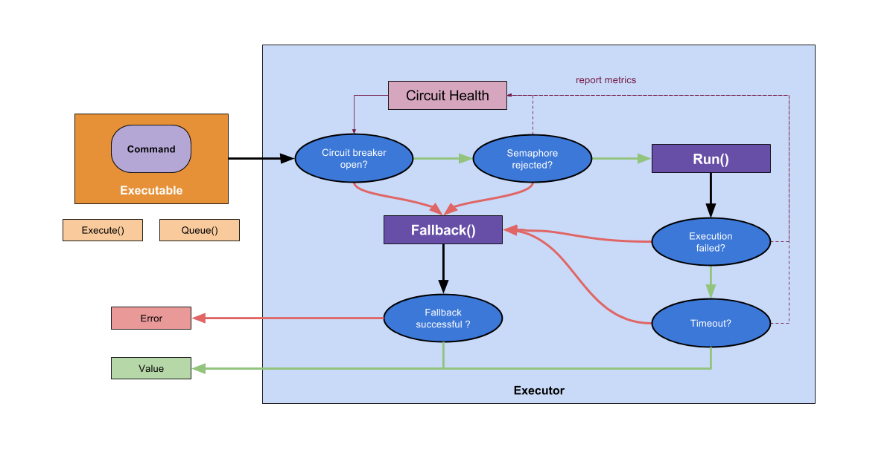

# Blaze


## Prélude

---

## Résilience

* Désigne la capacité pour un corps, un organisme, une organisation ou un système quelconque à **retrouver ses propriétés initiales** après une altération.

* Capacité d'un écosystème, d'une espèce ou d'un individu à **récupérer facilement** un fonctionnement normal après avoir subi une perturbation.

* Capacité d'un système **à fournir et à maintenir** un service minimum en cas d'attaques, d'incidents, de pannes ou de manques de ressources.

---

## Inspiration


Hystrix

---

### Pourquoi Blaze ?

---

### Micro Services



---


---

### Rien, parce que...

* Le réseau est fiable.
* Il n'y aura pas de latence.
* La bande passante est largement suffisante.
* Il n'y aura pas de panne.
* L'application n'a aucune exception.

---


---

### Quelques chiffres

* **30** services
* **99.99%** uptime par service
* **99.7%** uptime sur l'infrastructure _(99.99<sup>30</sup>)_
* **1 milliards** de requêtes
* **32 requêtes** par seconde
* **3 millions** d'erreurs
* **2+ heures** de pannes par mois

---


### En théorie, la réalité est pire...

---

### Ses principes

* Contrôle des latences et des pannes des dépendances ou sources externes.
* Stopper les cascades de défaillance dans les systèmes distribués.
* Échoue vite, en silence, mais récupère rapidement.
* Dégradation en finesse et solution alternative.
* Supervision et monitoring en temps _-presque-_ réel _(soon)_.

---

### Ses concepts

* Timeout
* Circuit Breaker
* Load shedder
* Fail fast
* Isolation
* Escalation
* Failover
* Fallback
* Retry
* Recover

---

# Atelier pratique


_Assez de théorie, montre moi ton code!_

---

### Hello World

```go
import "github.com/ulule/blaze"

type HelloWorldCommand struct {
    name string
}

func (HelloWorldCommand) Options() blaze.CommandOptions {
    return blaze.NewCommandOptions().
        WithTimeout(500 * time.Millisecond)
}
```

---

### Hello World

```go
func (HelloWorldCommand) Name() string {
    return "HelloWorld"
}

func (HelloWorldCommand) Group() string {
    return "ExampleGroup"
}
```

---

### Hello World

```go
func (e HelloWorldCommand) Run() (interface{}, error) {
    // A real example would do something like a network call here.
    return fmt.Sprintf("Hello %s!", e.name), nil
}

func (e FooCommand) Fallback() (interface{}, error) {
    return "Hello !", nil
}
```

---

### Import

```go
import "github.com/ulule/blaze"

ctx := blaze.Blaze(context.Background())
command := blaze.NewCommand(ctx, &HelloWorldCommand{
    name: "thomas",
})
```

---

### Exécution synchrone

```go
value, err := command.Execute()
if err != nil {
    // Handle error here...
}

message := value.(string)
fmt.Println(message)
```

---

### Exécution asynchrone

```go
valueChan, errChan := command.Queue()

// Do some stuff here...

err := <-errChan
if err != nil {
    // Handle error here...
}

value := <-valueChan
message := value.(string)
fmt.Println(message)
```

---

### Comment ça marche ?



---

### Demo avec Knuckles


---

### La suite...

* Plugins
  * Event Notifier
  * Metrics Publisher
* Dashboard

---


### Conclusion
